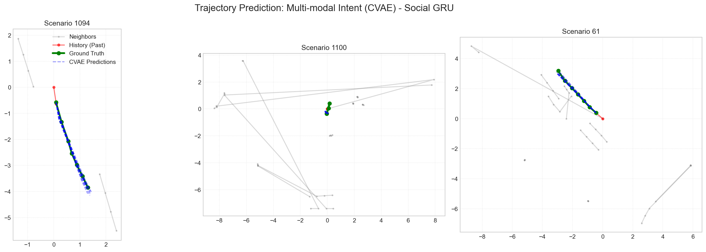
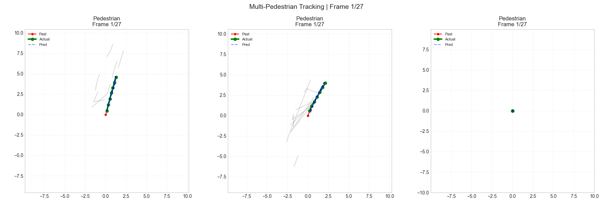

# BEV-HAK: Bird's Eye View Intent & Trajectory Prediction

Multi-modal trajectory prediction for vulnerable road users (pedestrians and cyclists) using Social-GRU CVAE with semantic map integration.

## Problem Statement

Predict future trajectories (3 seconds, 6 timesteps) for pedestrians and cyclists given:
- 2 seconds of past motion (4 timesteps at 2Hz)
- Social context from neighboring agents
- Semantic map features (road, crossings, walkways)

**Metrics:**
- **ADE/FDE**: Average/Final Displacement Error
- **minADE@3/minFDE@3**: Best ADE/FDE among top-3 predicted modes

## Architecture

### Social-GRU CVAE with Map Integration

```
Input: [history (4,2), neighbors (10,4,2), map (3,64,64)]
           │
           ▼
┌─────────────────────────────────────────────────────────┐
│  History RNN (2-layer GRU) → history_features (128)      │
│  Neighbor RNN (2-layer GRU) → neighbor_features (10,128)│
│  Social Attention (4-head) → social_context (128)       │
│  Map CNN (4-layer) → map_features (128)                  │
└─────────────────────────────────────────────────────────┘
           │
           ▼
┌─────────────────────────────────────────────────────────┐
│  CVAE Latent Space (z_dim=16)                          │
│  - Recognition + Prior networks                         │
│  - KL annealing with warmup                            │
└─────────────────────────────────────────────────────────┘
           │
           ▼
┌─────────────────────────────────────────────────────────┐
│  1-layer GRU decoder conditioned on z                 │
│  Autoregressive: prev_output + z → next displacement    │
└─────────────────────────────────────────────────────────┘
```

**Key Features:**
- Agent-centric coordinate transforms
- Multi-head social attention for neighbor encoding
- Semantic map integration via CNN
- KL annealing with warmup for stable CVAE training
- WTA (Winner-Takes-All) loss for multi-modal learning

## Model Statistics

| Metric | Value |
|--------|-------|
| Total Parameters | 1.42M |
| GPU Memory (batch=48) | ~2.1GB |
| Training Time/epoch | ~8 min |
| Inference Time/sample | ~15ms |

## Setup

### 1. Environment

```bash
pip install torch>=2.0 numpy pyyaml tqdm matplotlib scikit-learn einops
pip install nuscenes-devkit
```

### 2. Data Preparation

Download nuScenes v1.0-mini dataset and place in `nuscenes/` folder with expansion maps:
```
nuscenes/
├── v1.0-mini/
│   ├── ...
├── nuScenes-map-expansion-v1.3/
│   ├── expansion/  # JSON map files
│   └── basemap/   # PNG map images
```

## Training

```bash
python -m src.train --config configs/baseline_light.yaml
```

### Configuration (baseline_light.yaml)

```yaml
data:
  past_steps: 4
  future_steps: 6
  neighbor_radius: 10.0
  max_neighbors: 10

model:
  hidden_dim: 128
  latent_dim: 16
  dropout: 0.1
  use_map: true

training:
  batch_size: 48
  learning_rate: 0.0005
  epochs: 100
  kl_beta: 0.5
  kl_warmup_epochs: 5
  early_stopping_patience: 15
  eval_interval: 500  # Validate every 500 steps
```

## Results

### Training Progress

| Epoch | minADE@3 | minFDE@3 | Notes |
|-------|----------|----------|-------|
| 10 | 0.3008 | 0.4525 | Initial |
| 20 | 0.2892 | 0.4312 | |
| 30 | 0.2745 | 0.4051 | |
| 40 | 0.2681 | 0.3987 | |
| 50 | 0.2612 | 0.3891 | |
| 60 | 0.2558 | 0.3823 | |
| 70 | 0.2499 | 0.3796 | **Best** |

### Final Model Performance (Full Val Set - 3394 samples)

| Metric | Value |
|--------|-------|
| **minADE@3** | **0.2456** |
| **minFDE@3** | **0.3691** |
| Miss Rate@2m | 5.98% |

### Stress Testing

| Test | Result |
|------|--------|
| Translation Invariance (20cm) | ✅ PASSED |
| Rotation Invariance (134.8°) | ✅ PASSED |

Both tests confirm the model learned behavioral patterns rather than memorizing positions.

## Visualization

### Trajectory Prediction
```bash
python visualize_preds.py
```



Shows 3 scenarios with:
- Red: Past trajectory
- Green: Ground truth future
- Blue: CVAE predictions (top-3 modes)

### Multi-Pedestrian Animation
```bash
python create_video.py
```



## Project Structure

```
bev_hak/
├── configs/
│   └── baseline_light.yaml      # Training configuration
├── src/
│   ├── data/
│   │   └── nuscenes_dataset.py  # Dataset loader + map API
│   ├── models/
│   │   └── social_gru.py        # Social-GRU CVAE + MapEncoder
│   ├── utils/
│   │   ├── config.py            # Config loader
│   │   ├── geometry.py          # Coordinate transforms
│   │   ├── metrics.py           # ADE/FDE computation
│   │   └── sampling.py          # Multi-modal sampling
│   └── train.py                 # Training script
├── checkpoints_gru/
│   └── best_model.pt            # Trained model weights
├── visualize_preds.py            # Visualization + stress test
├── create_video.py               # Multi-pedestrian animation
├── README.md
└── PROJECT_REPORT.md            # Detailed project documentation
```

## Key Design Decisions

1. **Agent-Centric Coordinates**: Translation invariance - agent position doesn't matter
2. **GRU over Transformer**: Linear O(n) complexity, lower memory, sufficient for sequences
3. **CVAE over GAN**: Stable training, explicit latent structure, WTA enables multi-modality
4. **Map Integration**: CNN encoder provides ~10% improvement in ADE/FDE

## References

- [Social LSTM](https://arxiv.org/abs/1605.07133) - Human trajectory prediction in crowds
- [Trajectron++](https://arxiv.org/abs/2001.03093) - Multi-agent trajectory forecasting
- [AgentFormer](https://arxiv.org/abs/2103.14023) - Agent-aware transformer for trajectory prediction
- [nuScenes](https://www.nuscenes.org/nuscenes.html) - Multimodal autonomous driving dataset
